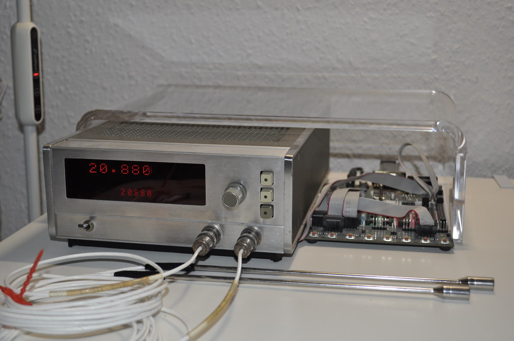

# HP2803A

A two-channel instrument that uses quartz crystal resonators with a linear frequency-temperature characteristic to measure temperature to a maximum resolution of 0.0001°C at 10 second intervals.

*Instrument (left) connected to Atmel STK500 development board (right).*

## Operation

The device is primarily operated by three push-buttons ('select', 'back' and 'cancel') and a rotary encoder.

This short video shows the user changing the display units from Celsius to Fahrenheit:

## Architecture

The firmware is written in C and targets an AVR ATmega644A microcontroller with an A64-based simulator for development and testing.

## Documentation

Doxygen documentation is available at https://jlenardi.github.io/HP2803A/

